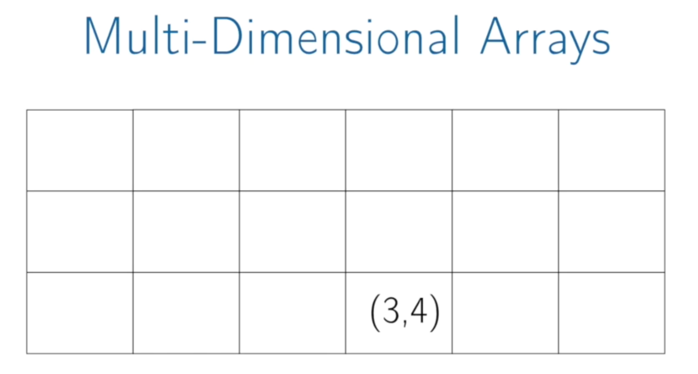
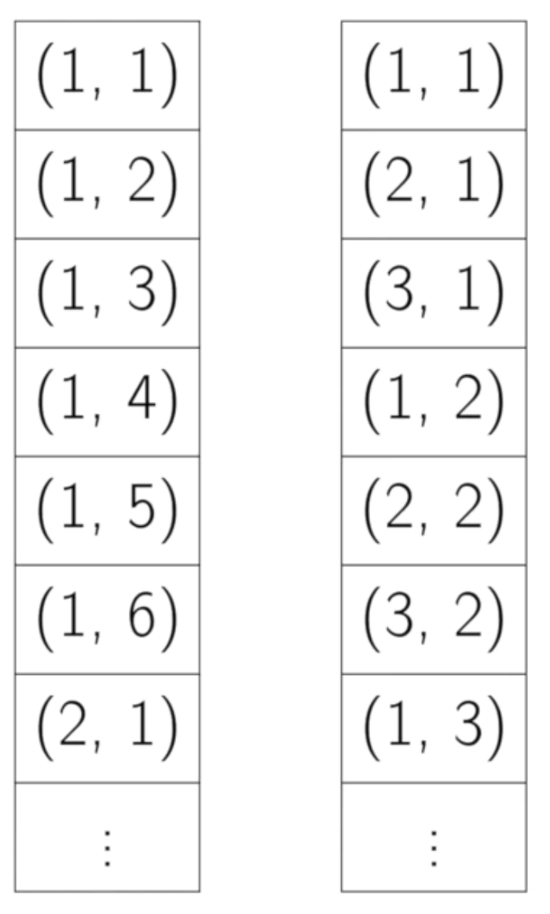
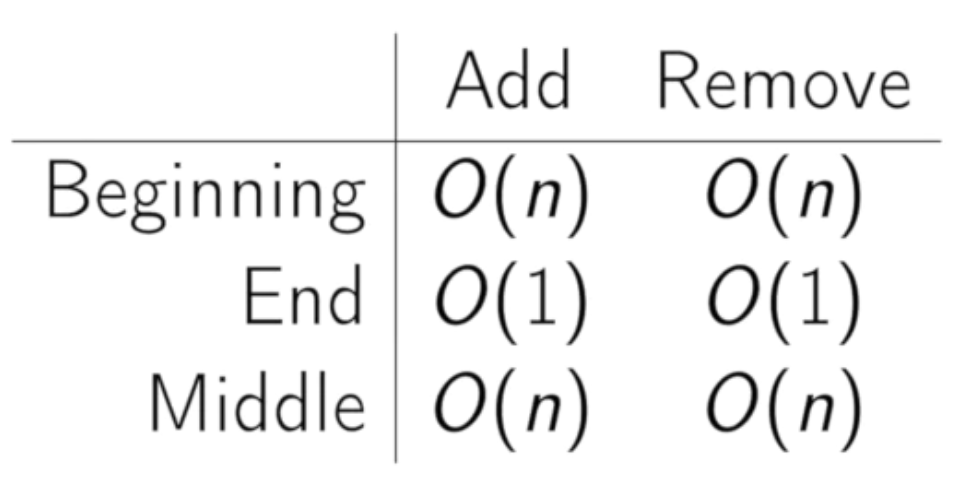

# **[Arrays | Coursera](https://www.coursera.org/lecture/data-structures/arrays-OsBSF?authMode=signup&redirectTo=%2Flecture%2Fdata-structures%2Farrays-OsBSF)**

## 1. Arrays

- Array : 메모리의 연속적인 영역
  - 하나의 메모리 청크

 

- Key Point : random access
  - 배열의 어느 특정한 요소에 접근할 수 있다.
  - "Constant time access to read, Constant time access to wright"

 
- 각 원소의 영역은 모두 같은 사이즈로 할당이 된다.

- 원소의 주소를 도출하는 수식
  $$arrayAddr + elemSize * (i - firstIndex)$$

 
 

---

## 2. Multi-Dimensional Arrays

- `row - column` 쌍으로 표현이 가능하다.

 

- 접근 방법
  - 접근하려는 요소 이전의 행들을 건너뛴다.
  - 한 행의 모든 요소들의 개수를 곱한다.

$$ elemSize _ ((3-1) _ 6 + (4-1)) $$

 

### 2-1. row-major ordering & column-major ordering

_(좌 : row-major ordering | 우 : column-major ordering)_

- 메모리에는 다음과 같이 배치된다.

 

- row-major ordering : 원소가 행에 따라 연속적으로 배치되는 방식
- column-major ordering : 원소가 열에 따라 연속적으로 배치되는 방식
  - _언어와 컴파일러마다 다르다._

 
 

---

## 3. Times for Common Operations

- beginning : n개 요소 재정렬
- end : 전체 원소의 개수만 업데이트하면 됨
- middle : n/2개 요소 재정렬

 

- :star: **핵심 : 원소에 접근/읽기/쓰기에 일정한 시간이 소요된다.**

 
 

---

## ✨ Summary

- Array : contiguous area of memory consisting of equal-size elements indexed by contiguous integers.
- Constant-time access to any element.
- Constant time to add/remove at the end.
- Linear time to add/remove at an arbitrary location.
