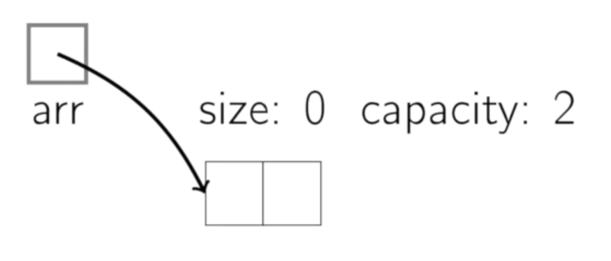
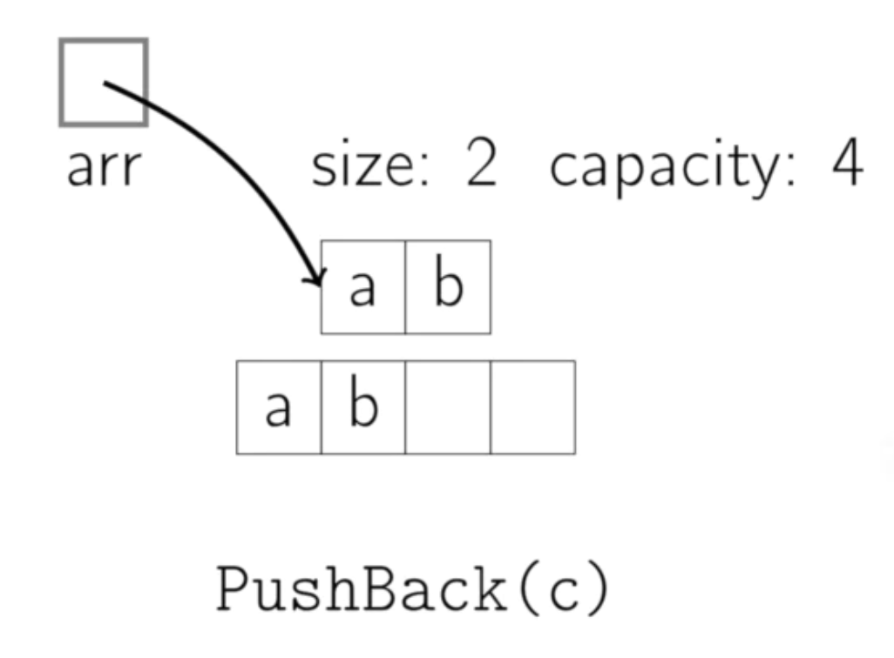

# **[Dynamic Arrays | Coursera](https://www.coursera.org/lecture/data-structures/dynamic-arrays-EwbnV)**

## 1. Problem

- 문제 사항 : 배열은 정적이다.
  - 해결 : 런타임시에 크기가 결정되는 동적 가변 배열을 사용한다.

 

- Solution : dynamic arrays
  - 동적으로 할당되는 배열의 포인터를 저장하고 새로 할당이 필요할 때에는 해당 포인터를 바꾼다.
  - 이전 배열의 원소들을 복사하고 이전 배열의 위치를 가리키던 포인터 값을 새로운 배열을 가리키는 포인터 값으로 바꾼다.

 

- Operations
  - `get(i)` : i번째에 위치한 원소
  - `set(i, val)` : i번째 위치에 val 삽입
  - `pushback(val)` : val을 마지막 위치에 삽입
  - `remove(i)` : i번째에 위치한 원소 제거
  - `size(i)` : 전체 원소 개수

 

- size :vs: capacity
  

 

- 배열이 다 찼을 경우
  1. 원래 크기의 두 배만큼 새로운 배열을 만든다.
  2. 기존 원소들을 복사하여 넣는다.
  3. 원래의 포인터 위치를 새 배열의 포인터 위치로 바꾼다.

 
 

---

## 2. Common Implementations

- C++ : vector
- Java : ArrayList
- Python : list
  - python에서는 정적 배열을 표현할 수 없다.

 
 

---

## 3. Runtimes

- `get(i)` : $O(1)$
- `set(i, val)` : $O(1)$
- `pushback(val)` : $O(n)$
- `remove(i)` : $O(n)$
- `size()` : $O(1)$

 
 

---

## ✨ Summary

- Unlike static arrays, dynamic arrays can be resized.
- Appending a new element to a dynamic array is often constant time, but can take $O(n)$.
- Some space is wasted.
