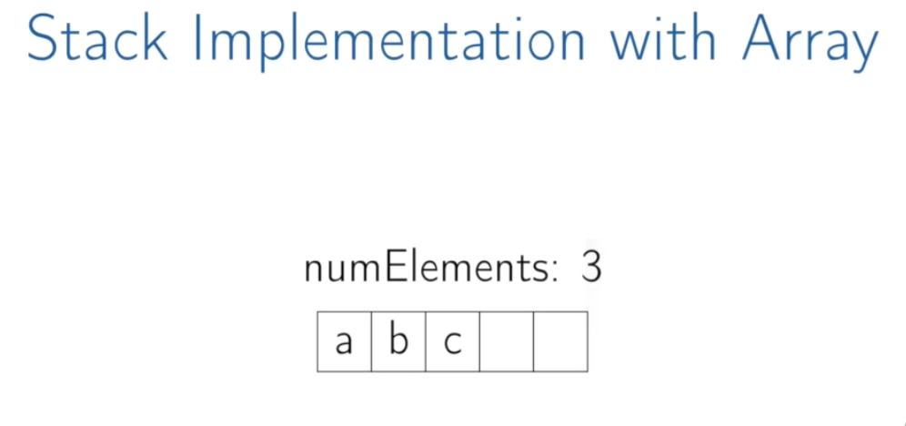
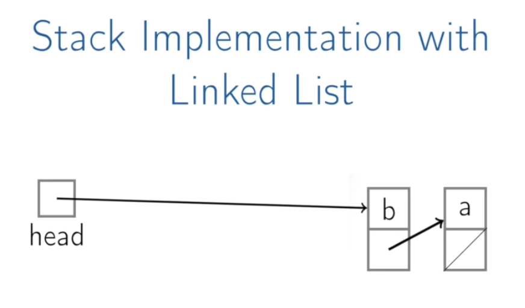

# [Stacks | Coursera](https://www.coursera.org/lecture/data-structures/stacks-UdKzQ)

- stack : abstract data type
  - `push(key)`
  - key `top()`
  - key `pop()`
  - boolean `empty()`

<br>

- e.g.
  - Balanced Brackets : 괄호 균형 문제

<br>

📄 IsBananced(str)

```plain
Stack stack
for char in str:
	if char in ['(', '[']:
		stack.Push(char)
	else:
		if stack.Empty(): return False
		top <- stack.Pop()
		if (top = '[' and char != ']') or
			(top = '(' and char != ')') :
				return False
return stack.Empty()
```

<br>



## Stack Implementation with Array

- appending to array : Push(b)
  - $O(1)$
- top of elements : Top()
  - $O(1)$
- get the elements & remove the top : Pop()
  - $O(1)$
- is empty : Empty()
  - $O(1)$

<br>

## Stack Implementation with Linked List



- 배열의 단점을 극복하기 위해 링크드 리스트를 사용할 수도 있다.

  - 처음에 할당한 배열을 기준으로 최대 크기 수용
  - 공간 낭비의 가능성 존재

- Push(b) = PushFront()
- Top() = TopFront() + PopFront()

<br>
- 배열과 동일하게 모두 $O(1)$ 복잡도 소요
- 메모리가 있는 한 계속해서 원소 추가 가능

<br>
- But, 포인터 저장에 따른 오버헤드 존재

<br>
<br>

## Summary

- Stacks can be implemented with either an array or a linked list.
- Each stack operation is $O(1)$ : Push, Pop, Top, Empty
- Stacks are ocassionaly known as LIFO queues.
  - _😲 ≒ GIGO_
